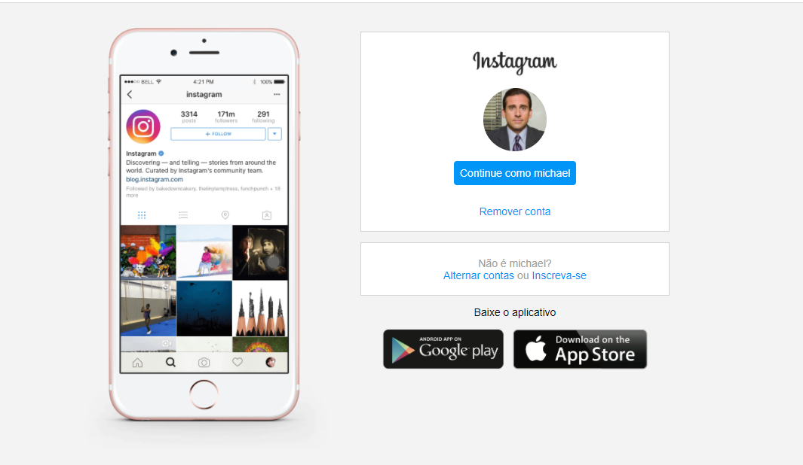

# layout-instagram

projeto desenvolvido no Bootcamp da Digital Innovation One

**{c:Violeta}objetivo:{/c}** recriar o layot inicial do Instagram utilizando flexbox

**{c:Violeta}stacks{/c}**: HTML, CSS

